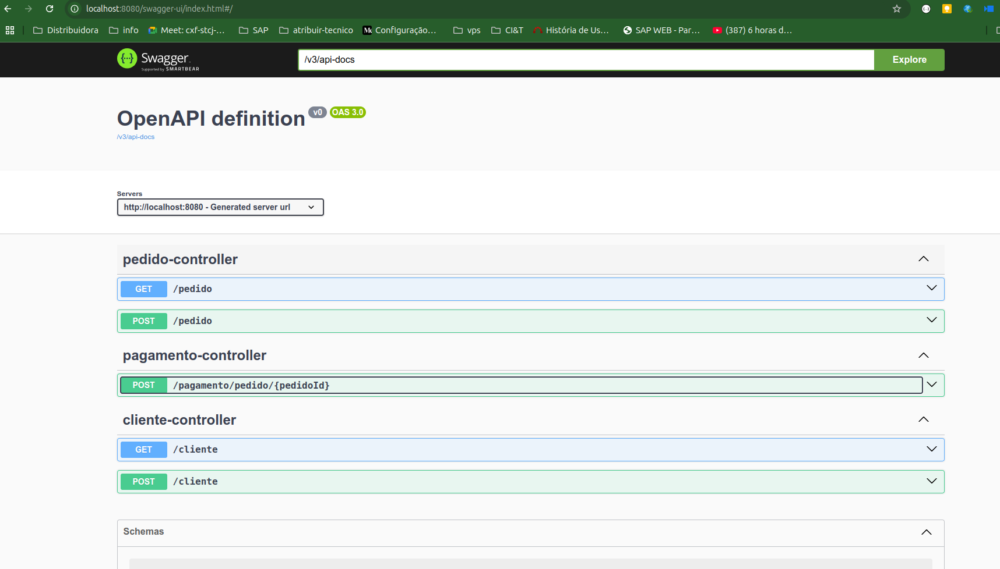
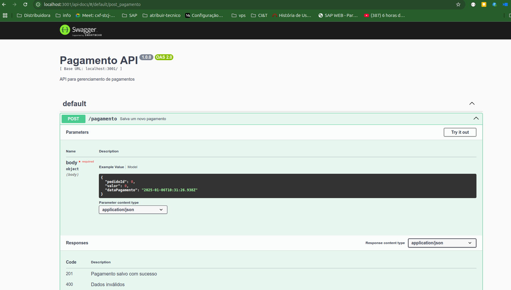
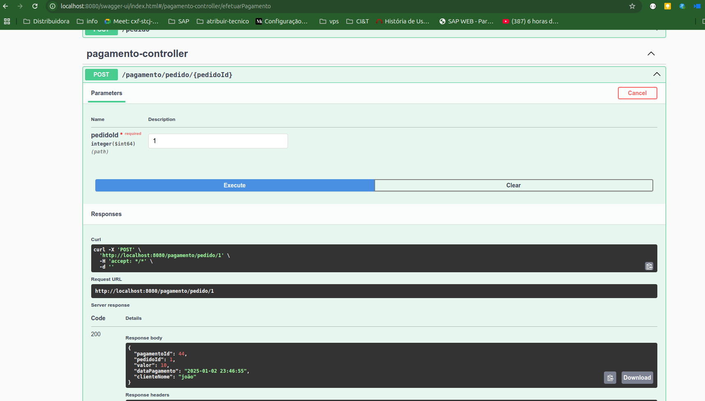

# Getting Started 

## Start docker-compose
- Criar o bando de dados mysql
```
docker-compose up
```

## Start project checkout
na raiz do projeto checkout execute os comandos abaixo

```
mvn clean install

mvn spring-boot:run

```

para testar as api utilize o swagger http://localhost:8080/swagger-ui/index.html#




## Start project pagamento-api

na raiz do projeto pagamento-api execute os comandos abaixo

```
npm install

node src/server.js
```



## Testar os endpoints

- Criar um cliente na base de dados:
```
curl -X 'POST' \
  'http://localhost:8080/cliente' \
  -H 'accept: */*' \
  -H 'Content-Type: application/json' \
  -d '{
  "nome": "Claudemir",
  "saldo": 100
}'
```

- Criar um pedido 
```
curl -X 'POST' \
  'http://localhost:8080/pedido' \
  -H 'accept: */*' \
  -H 'Content-Type: application/json' \
  -d '{
  "clienteId": 1,
  "valor": 10
}'
```

- Realizar o pagamento 

```
curl -X 'POST' \
  'http://localhost:8080/pagamento/pedido/1' \
  -H 'accept: */*' \
  -d ''
```




- Para testar o cenário de falha no pagamento, segue os pasos:
    - 1 Criar um novo pedido;
    - 2 parar o microservice pagamento-api;
    - 3 chamar o endpoint abaixo, passando o codigo do pedido

```
curl -X 'POST' \
  'http://localhost:8080/pagamento/pedido/1' \
  -H 'accept: */*' \
  -d ''
```


